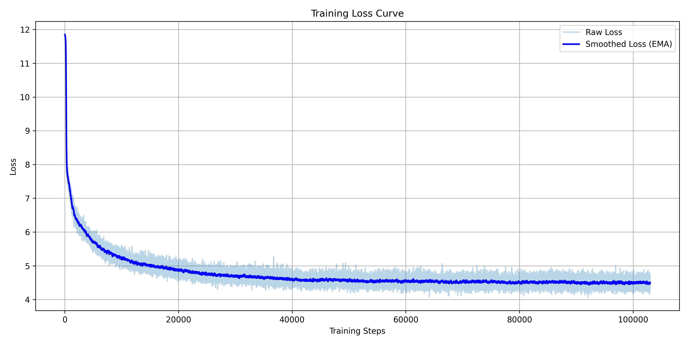

# GPT-like Language Model with MoE and Optimizations

A compact yet powerful GPT-style language model designed with modern efficiency techniques. This repo combines Mixture of Experts (MoE), weight tying, RMSNorm, embedding scaling, and memory-efficient practices — ideal for pretraining on moderate hardware like a single T4 GPU.

---

## 🔧 Key Highlights

* **Token-wise Top-k MoE**: Each token dynamically selects only `k` experts (out of `n`) in the feedforward block. This keeps computational cost and memory usage low without sacrificing model capacity.
* **Expert Parameter Reduction**: Instead of each expert using the full FFN hidden size, each expert operates on a fraction: `feed_forward // num_experts`. This means memory and compute stay constant, but specialized. For 2048 FFN size and 8 experts, each expert only uses 256 units.
* **128-d Hidden Projections**: Input embeddings are learned at 128d and projected up to 512d before the transformer, reducing initial memory cost and speeding up embedding lookup.
* **Weight Tying**: Input and output embeddings share weights, reducing parameter count and improving generalization.
* **RMSNorm**: Lighter and faster than LayerNorm; used in LLama and other cutting-edge LLMs.
* **Pre-Norm Setup**: Normalization happens before attention and FFN, improving training stability in deeper transformers.
* **No Bias Terms**: All Linear layers omit bias to further minimize memory footprint.

---

## 🧠 Architecture Overview

The architecture follows a classic decoder-only transformer with:

* **4 Decoder Layers**
* **512 Embedding Dimension**
* **8 Attention Heads**
* **2048 FFN Hidden Size** (total, split across experts)
* **8 Experts per MoE Layer**, using **Top-2** routing per token

Instead of processing all tokens through a full 2048-wide FFN, the **Mixture of Experts (MoE)** structure uses multiple smaller expert blocks (each 256 wide), and each token routes only through 2 experts. This reduces the effective activation and parameter footprint while increasing representational capacity.

The model also includes a load balancing loss to ensure expert utilization remains even, which helps prevent expert collapse and encourages specialization.

---

## 📊 Loss Curve

The training loss (smoothed using EMA) is visualized above). The smoother training progression is evidence of stable convergence thanks to pre-norm + MoE + RMSNorm combo.

---

## 🚀 Quick Start

### Installation

```bash
pip install -r requirements.txt
```

### Training

```bash
python train.py
```

The model is trained on HuggingFace's streaming `Zyphra/Zyda-2` dataset (sampled version). You can easily plug in your own dataset by modifying `hparams.json`.

---

## 🧬 Design Principles

* **Conditional Computation**: Tokens route to only a few experts (Top-2), reducing overall compute vs dense FFN.
* **Memory Efficiency**: MoE, embedding projection, and no bias design all help minimize activation and parameter overhead.
* **Gradient Accumulation Support**: Makes training feasible on lower-memory GPUs by simulating larger batch sizes.
* **Streaming Dataset**: HuggingFace's streaming loader enables training on huge datasets without loading everything into memory.
* **No RoPE/Rotary Embeddings**: Since the context size is capped at 512, simpler learned embeddings are sufficient and lighter.
* **Explicit Causal Masking**: Done manually in attention to retain control and avoid backend black-boxes.

---

## 📦 Files Overview

* `modelling.py` – Core GPT model: Embeddings, Attention, MoE, Decoder, Generator
* `train.py` – Full training pipeline, AMP usage, dataloaders, optimizer, schedulers
* `tokenizer.py` – SentencePiece-based tokenizer with BOS/EOS support
* `hparams.json` – Config file with training hyperparameters
* `log_curve.png` – Smoothed training loss curve

---

## 🧪 Tokenizer

Wrapped using `sentencepiece`, this tokenizer supports:

* BOS / EOS / PAD tokens
* Efficient batching and padding
* Fast `Encode` and `Decode`

---

## 📌 Additional Notes

* AMP (`torch.amp`) and gradient scaling are enabled for mixed-precision stability.
* Cosine LR Scheduler with warmup is included.
* Weight decay is excluded from normalization and embedding layers for better optimization.
* MoE layer returns an auxiliary loss term (load balancing) combined with the main loss via a configurable alpha weight.

---

## 👨‍💻 Author

Crafted by **Dellano Samuel Fernandez** — passionate about building smarter, faster AI with real hardware limits in mind.

If this project helped or inspired you, feel free to ⭐️ it or reach out!
